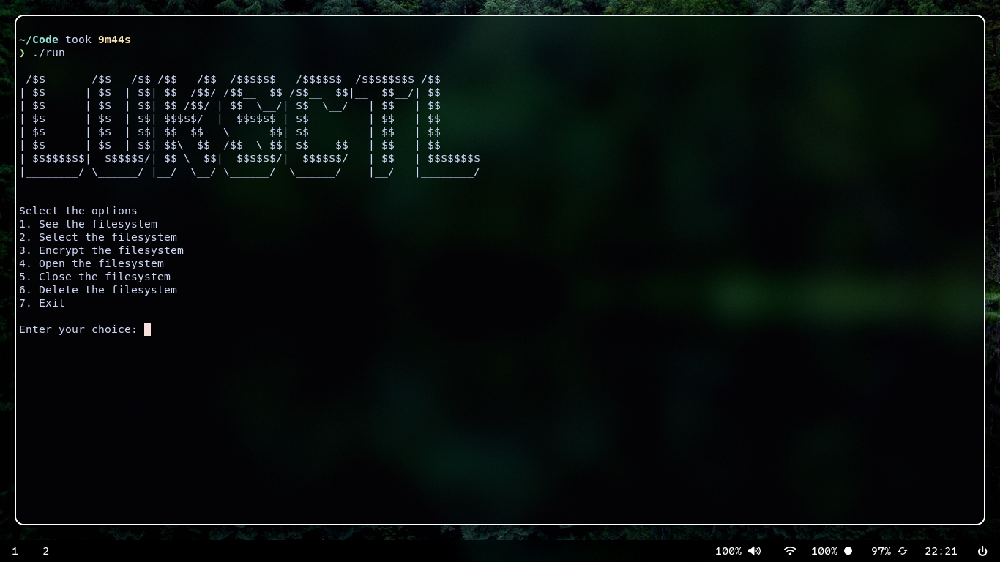

# 🔒 LUKSCTL

A simple terminal-based utility for managing LUKS-encrypted volumes on Linux.

<p align="center">
  
</p>

## Features

- 🔐 Encrypt block devices with LUKS
- 🔓 Open encrypted volumes
- 🔒 Close encrypted volumes
- 💾 Initialize filesystems
  - ext4
  - exFAT
  - Btrfs
- 🗑️ Wipe existing filesystem signatures
- 📦 Simple terminal interface


## Requirements

- Linux
- cryptsetup
- util-linux
- exfatprogs (optional, for exFAT)
- btrfs-progs (optional, for Btrfs)

## Build

```bash
g++ -std=c++17 main.cpp -o luksctl
```

## Usage

Run as root (or with sudo):

```bash
sudo ./luksctl
```

Follow the interactive menu to:

- Select a block device
- Encrypt it
- Open encrypted volumes
- Format the mapped device
- Close the volume
- Wipe the device

## Example

```text
1. See Filesystems
2. Select Filesystem
3. Encrypt Filesystem
4. Open Filesystem
5. Close Filesystem
6. Delete Filesystem
7. Exit
```

## Notes

- Formatting a device permanently erases existing data.
- Always verify the selected device before encrypting or wiping it.
- LUKSCTL is intended for removable drives and testing. Use caution with system disks.

## License

MIT License
